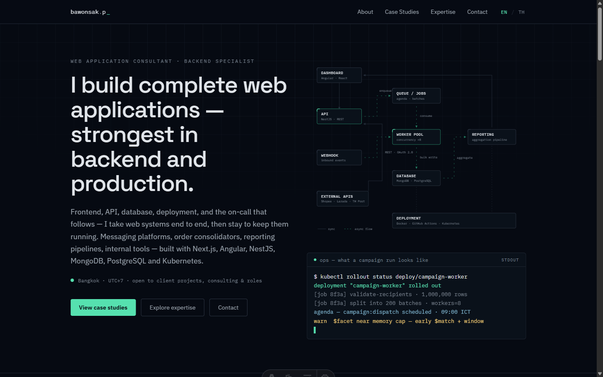

# Bawonsak Petchbunjerdkul — Portfolio

Bilingual (EN / TH) personal portfolio for a Web Application Consultant · Backend Specialist.
Built with **Astro 6 + TypeScript + Tailwind CSS 4 + MDX**, fully static, dark-mode-first.

**Live demo:** [bawonsak.pages.dev](https://bawonsak.pages.dev)



- English routes: `/`, `/about`, `/case-studies`, `/case-studies/<slug>`, `/expertise`, `/contact`
- Thai routes: same paths under `/th/...`
- Route-aware language switcher, `hreflang` + canonical metadata, OpenGraph tags.

## Run locally

```bash
npm install
npm run dev        # http://localhost:4321
```

## Build & preview

```bash
npm run build      # outputs static site to dist/
npm run preview    # serve dist/ locally
```

## Deploy — Cloudflare Pages

1. Push this folder to a Git repository (GitHub/GitLab).
2. Cloudflare dashboard → **Workers & Pages → Create → Pages → Connect to Git**.
3. Settings:
   - Framework preset: **Astro**
   - Build command: `npm run build`
   - Build output directory: `dist`
4. Deploy. Add your custom domain under **Custom domains**.

(CLI alternative: `npx wrangler pages deploy dist`.)

## Deploy — Vercel

1. Push to a Git repository.
2. Vercel dashboard → **Add New → Project** → import the repo.
3. Vercel auto-detects Astro (build `npm run build`, output `dist`). Deploy.

(CLI alternative: `npx vercel`.)

## Before going live — checklist

- [x] Cloudflare Pages → Settings → **Environment variables** → `SITE_URL` (Production scope) = `https://bawonsak.pages.dev`. Every absolute URL (canonical/hreflang/OG/sitemap/robots) derives from it. Preview deploys auto-use `CF_PAGES_URL`, so leave `SITE_URL` unset for Preview.
- [x] `src/data/site.ts` → **GitHub / LinkedIn URLs** point to real profiles.
- [x] `public/og.png` (1200×630) is included. To regenerate after editing `public/og.svg`, render the SVG at 1200×630 and export as PNG.

## Where to edit content

| What | File |
|---|---|
| English page copy (home, about, expertise, contact) | `src/data/en.ts` |
| Thai page copy | `src/data/th.ts` |
| Name, email, socials, SEO titles/descriptions | `src/data/site.ts` |
| Case studies (English) | `src/content/case-studies/en/*.mdx` |
| Case studies (Thai) | `src/content/case-studies/th/*.mdx` |
| Small shared UI strings (nav, footer, labels) | `src/i18n/ui.ts` |
| Colors, fonts, design tokens | `src/styles/global.css` |
| Hero architecture diagram | `src/components/HeroArchitectureVisual.astro` |
| Terminal panel log lines | `terminal` section in `src/data/en.ts` / `th.ts` |

### Adding a case study

1. Create `src/content/case-studies/en/<slug>.mdx` **and** `src/content/case-studies/th/<slug>.mdx` with the same `slug` and `order` in frontmatter (schema in `src/content.config.ts`).
2. Routes, cards, and the language switcher pick it up automatically.

## Structure

```
src/
  components/        # 25 reusable components (+ pages/ = 5 per-page templates)
  content/case-studies/{en,th}/   # MDX case studies
  data/              # en.ts, th.ts, site.ts — all page content
  i18n/              # locale config, UI strings, route utils
  layouts/           # BaseLayout (SEO/hreflang), CaseStudyLayout
  lib/               # seo helpers
  pages/             # thin route files; th/ mirrors the root
  styles/global.css  # design tokens (OKLCH) + utilities
```

## License

Code is released under the [MIT License](LICENSE) — feel free to learn from or reuse the implementation.

Personal content — case-study copy, name, photos, branding, and the OG image — is **not** covered by the MIT license and remains © Bawonsak Petchbunjerdkul. Please replace it with your own if you fork this for your portfolio.
